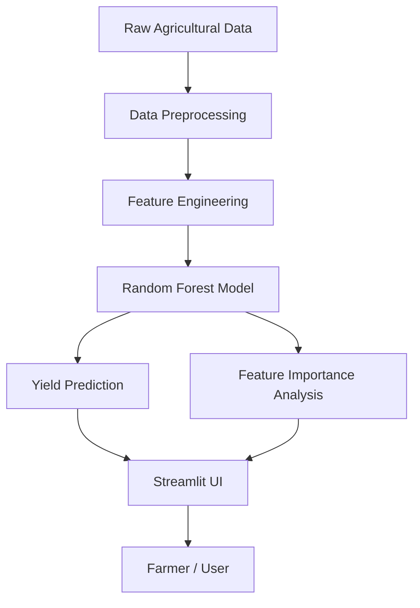

# System Architecture

The Intelligent Crop Yield Prediction System follows a standard Machine Learning pipeline designed for scalability and transparency.

## ML Pipeline Overview

## Component Details

### 1. Data Layer
- **Source**: Kaggle Crop Yield Dataset.
- **Features**: Rainfall, Temperature, Fertilizer Usage, Crop Type, etc.
- **Target**: `hg/ha_yield` (Yield in hectograms per hectare).

### 2. Processing Layer (`train.py`)
- **Preprocessing**: Removal of null values and irrelevant columns.
- **Encoding**: One-Hot Encoding for categorical variables.
- **Model**: Random Forest Regressor (Ensemble of 200 Decision Trees).
- **Evaluation**: Calculated MAE, RMSE, and R² score.

### 3. Analytics Layer
- **Model Storage**: `model/crop_model.pkl`.
- **Insights**: `model/feature_importance.json` stores the weight of each factor in predictions.

### 4. Presentation Layer (`app.py`)
- **Framework**: Streamlit.
- **Functionality**: CSV upload, batch prediction, and visual explanation of influencing factors.

